# PHÂN TÍCH SƠ BỘ CÁC QUY TRÌNH NGHIỆP VỤ

## Hệ sinh thái phân phối vé và vật phẩm sự kiện tích hợp sàn giao dịch thứ cấp và ứng dụng trí tuệ nhân tạo

> Tài liệu phân tích sơ bộ quy trình nghiệp vụ theo phương pháp luận BABOK v3 (Business Analysis Body of Knowledge), áp dụng kỹ thuật Process Modelling (BABOK 10.35) và Process Analysis (BABOK 10.34) với mô hình SIPOC.

---

## 1. TỔNG QUAN CÁC QUY TRÌNH NGHIỆP VỤ

Hệ thống được nhận diện gồm **7 quy trình nghiệp vụ chính** (Business Process), phân nhóm theo chuỗi giá trị (Value Chain):

| # | Quy trình nghiệp vụ | Nhóm | Tác nhân chính | Mức độ ưu tiên |
|---|---|---|---|---|
| BP-01 | Quản lý danh tính & phân quyền | Hỗ trợ | User, Organizer, Staff, Admin | Cao |
| BP-02 | Quản lý sự kiện & sơ đồ ghế | Cốt lõi | Organizer, Admin | Cao |
| BP-03 | Đặt vé & thanh toán | Cốt lõi | User | Rất cao |
| BP-04 | Phát hành & quản lý vé điện tử | Cốt lõi | Hệ thống, User | Rất cao |
| BP-05 | Giao dịch vé thứ cấp (Resale) | Mở rộng | User (Người bán), User (Người mua) | Cao |
| BP-06 | Thương mại vật phẩm sự kiện | Mở rộng | Organizer, User | Trung bình |
| BP-07 | Hỗ trợ thông minh (AI) | Thông minh | User, Hệ thống AI | Trung bình |

---

## 2. PHÂN TÍCH CHI TIẾT TỪNG QUY TRÌNH NGHIỆP VỤ

### 2.1. BP-01: Quy trình Quản lý Danh tính & Phân quyền

#### Mô hình SIPOC

| Thành phần | Nội dung |
|---|---|
| **Supplier** | User (người đăng ký), Google OAuth Provider |
| **Input** | Thông tin đăng ký (email, mật khẩu) hoặc token OAuth2 |
| **Process** | Xác thực danh tính → Phát hành JWT → Phân quyền RBAC |
| **Output** | Access Token + Refresh Token, hồ sơ người dùng với role tương ứng |
| **Customer** | Tất cả các phân hệ khác (Booking, Payment, Ticket...) |

#### Mô tả luồng quy trình

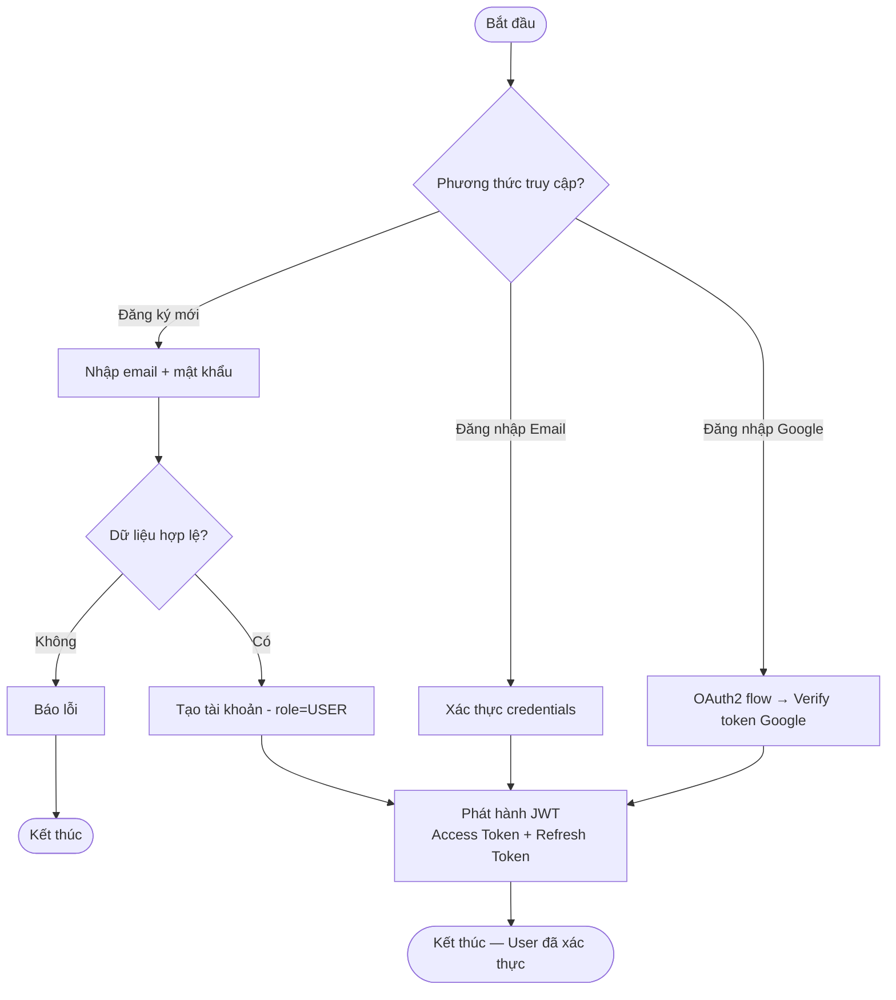

#### Quy tắc nghiệp vụ (Business Rules)

- BR-01.1: Mỗi email chỉ được đăng ký 1 tài khoản duy nhất.
- BR-01.2: Access Token có thời hạn ngắn (15-30 phút), Refresh Token có thời hạn dài hơn.
- BR-01.3: Hệ thống phân quyền 4 role: USER, ORGANIZER, STAFF, ADMIN — mỗi role có tập quyền hạn riêng biệt.
- BR-01.4: Tài khoản Organizer cần được Admin phê duyệt trước khi có quyền tạo sự kiện.

---

### 2.2. BP-02: Quy trình Quản lý Sự kiện & Sơ đồ ghế

#### Mô hình SIPOC

| Thành phần | Nội dung |
|---|---|
| **Supplier** | Organizer (nhà tổ chức sự kiện) |
| **Input** | Thông tin sự kiện (tên, mô tả, thời gian, địa điểm, banner), cấu hình sơ đồ ghế, hạng vé |
| **Process** | Tạo sự kiện → Thiết kế sơ đồ ghế → Cấu hình hạng vé → Gửi duyệt → Admin phê duyệt → Công khai |
| **Output** | Sự kiện đã công khai với sơ đồ ghế và hạng vé sẵn sàng bán |
| **Customer** | User (người mua vé), Booking Service |

#### Mô tả luồng quy trình

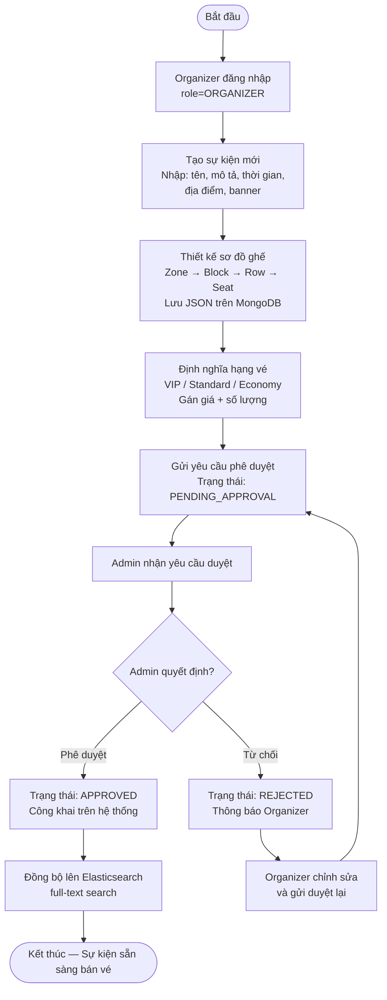

#### Quy tắc nghiệp vụ

- BR-02.1: Sự kiện phải được Admin phê duyệt trước khi hiển thị công khai.
- BR-02.2: Sơ đồ ghế tuân theo cấu trúc phân cấp Zone → Block → Row → Seat, lưu dạng JSON linh hoạt.
- BR-02.3: Mỗi hạng vé phải có giá > 0 và số lượng ghế xác định.
- BR-02.4: Organizer có thể chỉnh sửa sự kiện khi chưa mở bán. Sau khi mở bán, chỉ được sửa thông tin không ảnh hưởng đến vé đã bán.

---

### 2.3. BP-03: Quy trình Đặt vé & Thanh toán (Core Process) ⭐

> Đây là quy trình nghiệp vụ trọng tâm nhất của hệ thống, đòi hỏi xử lý đồng thời cao (High Concurrency) và đảm bảo tính nhất quán dữ liệu (Zero Oversell).

#### Mô hình SIPOC

| Thành phần | Nội dung |
|---|---|
| **Supplier** | User (người mua vé), Catalog Service (thông tin sự kiện + ghế) |
| **Input** | Lựa chọn sự kiện, ghế ngồi, hạng vé; thông tin thanh toán |
| **Process** | Chọn ghế → Khóa ghế (Redis Lock) → Tạo đơn hàng → Thanh toán (VNPay/MoMo) → Xác nhận |
| **Output** | Đơn hàng CONFIRMED, vé điện tử được sinh, email xác nhận |
| **Customer** | User (nhận vé), Organizer (nhận doanh thu), Ticket Service, Notification Service |

#### Mô tả luồng quy trình

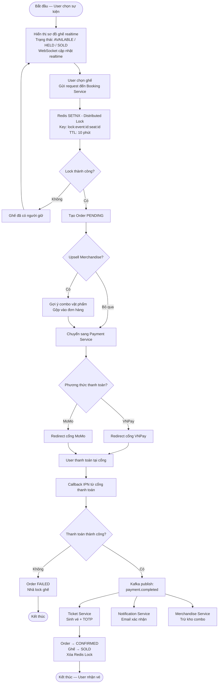

#### Xử lý ngoại lệ

| Tình huống | Xử lý |
|---|---|
| Hết 10 phút không thanh toán | Redis TTL hết hạn → Lock tự nhả → Ghế trở lại AVAILABLE |
| User chủ động hủy đơn | Nhả lock ghế ngay lập tức, Order → CANCELLED |
| Cổng thanh toán timeout | Retry cơ chế hoặc đánh dấu Order PAYMENT_TIMEOUT, nhả lock |
| 1000+ request cùng 1 ghế | Redis SETNX atomic → chỉ 1 request thành công, còn lại nhận phản hồi ngay |

#### Quy tắc nghiệp vụ

- BR-03.1: Mỗi ghế chỉ được 1 user giữ tại 1 thời điểm (Zero Oversell).
- BR-03.2: Thời gian giữ ghế tối đa 10 phút. Hết thời gian → tự động nhả.
- BR-03.3: Đơn hàng có thể bao gồm cả vé + merchandise (combo upsell).
- BR-03.4: Thanh toán được xử lý bất đồng bộ qua Kafka để giảm coupling.
- BR-03.5: Hệ thống phải chịu tải ≥ 1.000 request/giây cho luồng đặt vé.

---

### 2.4. BP-04: Quy trình Phát hành & Quản lý Vé điện tử

#### Mô hình SIPOC

| Thành phần | Nội dung |
|---|---|
| **Supplier** | Booking Service (đơn hàng đã xác nhận), Payment Service (sự kiện thanh toán thành công) |
| **Input** | Thông tin đơn hàng CONFIRMED, thông tin ghế, thông tin user |
| **Process** | Sinh vé → Tạo TOTP Secret → Generate QR động → Phát hành Wallet Pass → Check-in |
| **Output** | Vé điện tử với QR động, file .pkpass (Apple) / Google Wallet Object |
| **Customer** | User (sử dụng vé), Staff (soát vé) |

#### Mô tả luồng quy trình — Phát hành vé

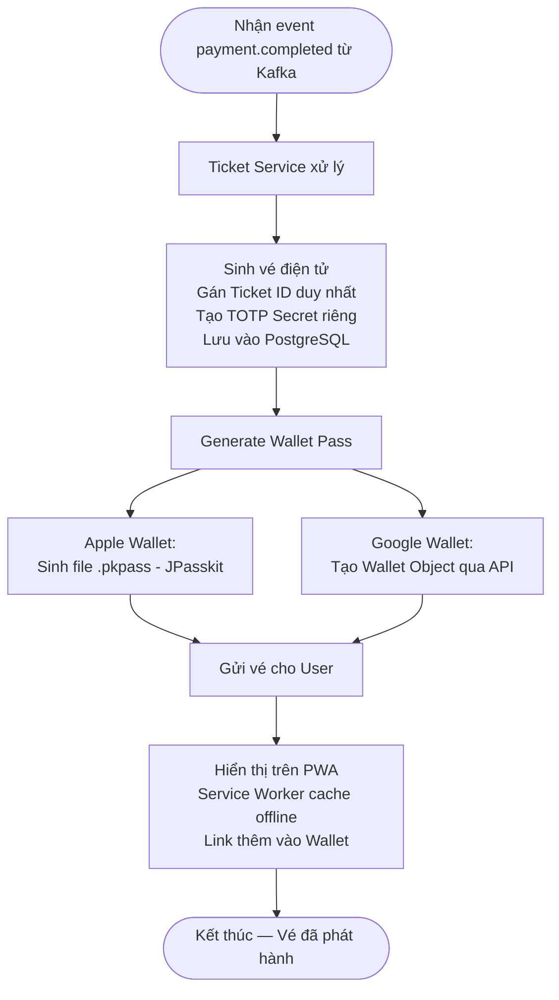

#### Mô tả luồng quy trình — Check-in tại sự kiện

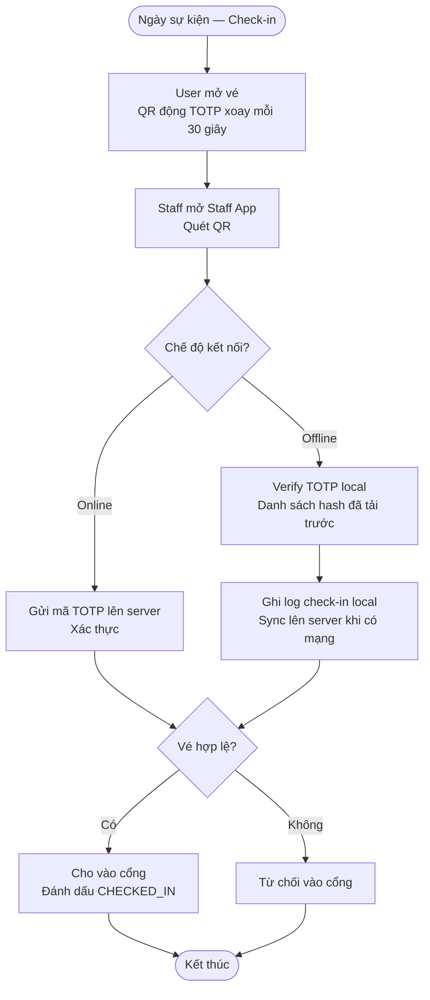

#### Quy tắc nghiệp vụ

- BR-04.1: Mỗi vé có 1 TOTP Secret duy nhất, QR code thay đổi mỗi 30 giây (RFC 6238).
- BR-04.2: Ảnh chụp màn hình QR hết hạn sau 30 giây → không thể sử dụng.
- BR-04.3: Mỗi vé chỉ được check-in 1 lần. Sau khi check-in → trạng thái USED.
- BR-04.4: Staff App phải tải trước danh sách hash vé trước sự kiện để hỗ trợ check-in offline.
- BR-04.5: Kết quả check-in offline được đồng bộ lên server khi có kết nối trở lại (eventual consistency).

---

### 2.5. BP-05: Quy trình Giao dịch Vé Thứ cấp (Resale) ⭐

#### Mô hình SIPOC

| Thành phần | Nội dung |
|---|---|
| **Supplier** | User-Seller (người bán vé), User-Buyer (người mua vé) |
| **Input** | Vé hợp lệ chưa sử dụng (từ Seller), yêu cầu mua (từ Buyer), thanh toán |
| **Process** | Niêm yết → Kiểm soát giá → Mua → Escrow → Chuyển nhượng → Hủy QR cũ / Sinh QR mới |
| **Output** | Vé mới cho Buyer (TOTP secret mới), tiền cho Seller, vé cũ vô hiệu |
| **Customer** | User-Buyer (nhận vé mới), User-Seller (nhận tiền) |

#### Mô tả luồng quy trình — Niêm yết & Giao dịch

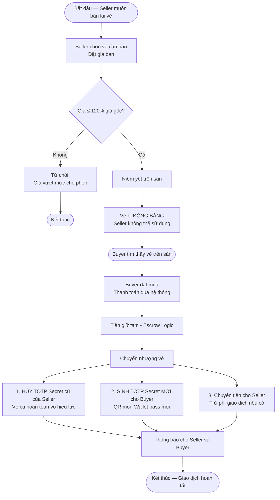

#### Mô tả luồng quy trình — Hủy niêm yết

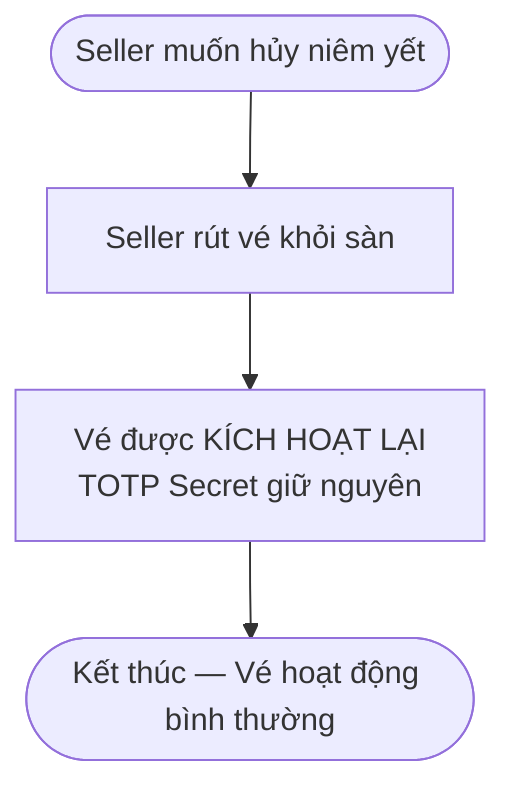

#### Quy tắc nghiệp vụ

- BR-05.1: Giá bán lại không được vượt quá 120% giá gốc (chống đầu cơ).
- BR-05.2: Vé bị đóng băng (frozen) trong suốt thời gian niêm yết — Seller không thể sử dụng.
- BR-05.3: Khi giao dịch thành công, TOTP Secret cũ bị hủy vĩnh viễn, sinh secret mới cho Buyer.
- BR-05.4: Tiền được giữ tạm (escrow) cho đến khi chuyển nhượng hoàn tất.
- BR-05.5: Seller có quyền hủy niêm yết bất kỳ lúc nào trước khi có người mua.

---

### 2.6. BP-06: Quy trình Thương mại Vật phẩm Sự kiện (Merchandise)

#### Mô hình SIPOC

| Thành phần | Nội dung |
|---|---|
| **Supplier** | Organizer (tạo & quản lý vật phẩm) |
| **Input** | Thông tin sản phẩm (tên, mô tả, giá, ảnh, tồn kho), cấu hình combo |
| **Process** | Tạo sản phẩm → Gắn với sự kiện → Tạo combo → Bán chéo trong luồng Booking hoặc bán độc lập |
| **Output** | Đơn hàng merchandise, cập nhật tồn kho |
| **Customer** | User (nhận vật phẩm), Organizer (doanh thu bổ sung) |

#### Mô tả luồng quy trình

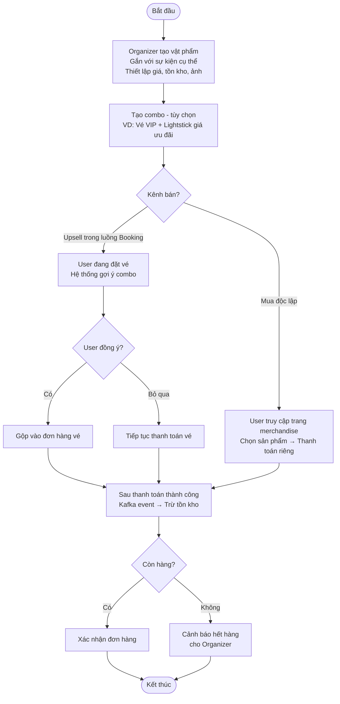

#### Quy tắc nghiệp vụ

- BR-06.1: Vật phẩm phải gắn với ít nhất 1 sự kiện.
- BR-06.2: Tồn kho được cập nhật realtime, cảnh báo khi sắp hết.
- BR-06.3: Combo upsell chỉ hiển thị trong luồng Booking khi sự kiện có vật phẩm liên quan.
- BR-06.4: Đơn hàng merchandise có thể gộp chung hoặc tách riêng với đơn vé.

---

### 2.7. BP-07: Quy trình Hỗ trợ Thông minh (AI Service)

#### Mô hình SIPOC

| Thành phần | Nội dung |
|---|---|
| **Supplier** | Catalog Service (dữ liệu sự kiện), User (hành vi + câu hỏi) |
| **Input** | Mô tả sự kiện, lịch sử mua vé/xem sự kiện của user, câu hỏi ngôn ngữ tự nhiên |
| **Process** | TF-IDF vectorize → Cosine Similarity → Gợi ý / Semantic Search → Trả lời |
| **Output** | Danh sách sự kiện/vật phẩm gợi ý, câu trả lời chatbot |
| **Customer** | User (nhận gợi ý & câu trả lời) |

#### Luồng A: Recommender — Gợi ý sự kiện & vật phẩm

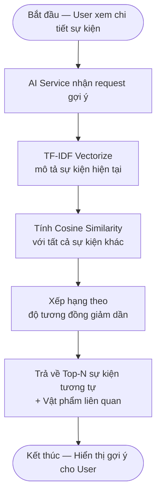

#### Luồng B: Chatbot Q&A — Hỏi đáp sự kiện

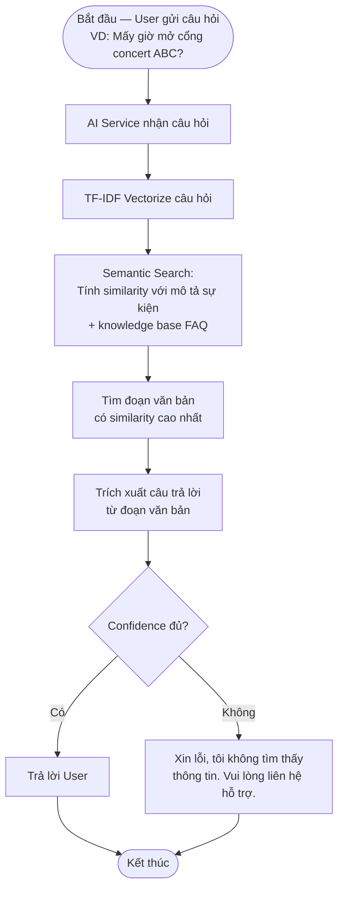

#### Quy tắc nghiệp vụ

- BR-07.1: Recommender sử dụng Content-based Filtering (TF-IDF + Cosine Similarity).
- BR-07.2: Chatbot chỉ trả lời dựa trên dữ liệu có sẵn (mô tả sự kiện + FAQ), không sinh nội dung tùy ý.
- BR-07.3: Khi confidence thấp, chatbot phải thông báo rõ ràng và hướng dẫn liên hệ hỗ trợ.
- BR-07.4: Dữ liệu TF-IDF được cập nhật khi có sự kiện mới hoặc sự kiện được chỉnh sửa.

---

## 3. MA TRẬN TƯƠNG TÁC GIỮA CÁC QUY TRÌNH (Process Interaction Matrix)

Bảng dưới thể hiện sự phụ thuộc và tương tác giữa các quy trình nghiệp vụ, giúp nhận diện các điểm tích hợp (integration points) quan trọng:

| Quy trình | BP-01 | BP-02 | BP-03 | BP-04 | BP-05 | BP-06 | BP-07 |
|---|---|---|---|---|---|---|---|
| **BP-01** Danh tính | — | Xác thực Organizer | Xác thực User | — | Xác thực Seller/Buyer | Xác thực User | — |
| **BP-02** Sự kiện | ← | — | Cung cấp sơ đồ ghế | — | — | Gắn vật phẩm với sự kiện | Cung cấp dữ liệu cho AI |
| **BP-03** Đặt vé | ← | ← | — | Trigger sinh vé (Kafka) | — | Upsell combo | — |
| **BP-04** Vé điện tử | — | — | ← | — | Hủy/Sinh TOTP khi resale | — | — |
| **BP-05** Resale | ← | — | — | Yêu cầu hủy/sinh vé mới | — | — | — |
| **BP-06** Merchandise | ← | ← | Gộp đơn hàng | — | — | — | Gợi ý vật phẩm |
| **BP-07** AI | — | ← | — | — | — | ← | — |

**Giao tiếp chính giữa các quy trình:**
- **Đồng bộ (REST/gRPC):** BP-01 ↔ tất cả (xác thực JWT), BP-02 → BP-03 (lấy sơ đồ ghế)
- **Bất đồng bộ (Kafka):** BP-03 → BP-04 (sinh vé), BP-03 → BP-06 (trừ kho), BP-03 → Notification (email)

#### Sơ đồ tương tác giữa các quy trình

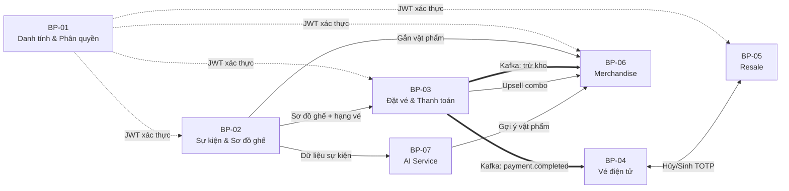

---

## 4. PHÂN TÍCH CÁC TÁC NHÂN VÀ VAI TRÒ (Stakeholder Analysis)

> Tham khảo BABOK v3, Section 2.4 — Stakeholders và Technique 10.39 — Roles and Permissions Matrix.

### 4.1. Ma trận Vai trò — Quyền hạn (RACI Matrix)

| Quy trình | User | Organizer | Staff | Admin | Hệ thống |
|---|---|---|---|---|---|
| BP-01: Đăng ký/Đăng nhập | **R** | **R** | **R** | **A** | I |
| BP-02: Tạo sự kiện | I | **R** | — | **A** | I |
| BP-03: Đặt vé | **R** | I | — | — | **A** |
| BP-04: Check-in | **R** | I | **R** | — | **A** |
| BP-05: Bán lại vé | **R** | I | — | **C** | **A** |
| BP-06: Mua merchandise | **R** | **R** | — | — | **A** |
| BP-07: Hỏi chatbot | **R** | — | — | — | **A** |

> R = Responsible (Thực hiện), A = Accountable (Chịu trách nhiệm), C = Consulted (Tham vấn), I = Informed (Được thông báo)

---

## 5. NHẬN DIỆN CÁC ĐIỂM NGHẼN VÀ RỦI RO NGHIỆP VỤ

> Tham khảo BABOK v3, Technique 10.38 — Risk Analysis and Management.

| # | Điểm nghẽn / Rủi ro | Quy trình liên quan | Mức độ | Giải pháp đề xuất |
|---|---|---|---|---|
| R-01 | Nghẽn cổ chai khi flash sale (hàng nghìn request đồng thời) | BP-03 | Rất cao | Redis Distributed Lock (SETNX) thay vì DB Lock |
| R-02 | Vé giả / ảnh chụp QR chia sẻ | BP-04 | Cao | QR động TOTP xoay 30 giây |
| R-03 | Mất kết nối mạng tại sự kiện | BP-04 | Cao | 3 lớp offline: Wallet + PWA Cache + Staff App Local Sync |
| R-04 | Đầu cơ vé trên sàn thứ cấp | BP-05 | Cao | Giá trần 120% giá gốc, đóng băng vé khi niêm yết |
| R-05 | Bán trùng ghế (Oversell) | BP-03 | Rất cao | Redis SETNX atomic + TTL tự nhả |
| R-06 | Mất message giữa các service | BP-03, BP-04 | Trung bình | Kafka at-least-once delivery + idempotent consumer |
| R-07 | Tranh chấp giao dịch resale | BP-05 | Trung bình | Escrow logic giữ tiền tạm, hủy TOTP cũ trước khi chuyển tiền |

---

## 6. TỔNG KẾT

### 6.1. Chuỗi giá trị tổng thể (End-to-End Value Chain)

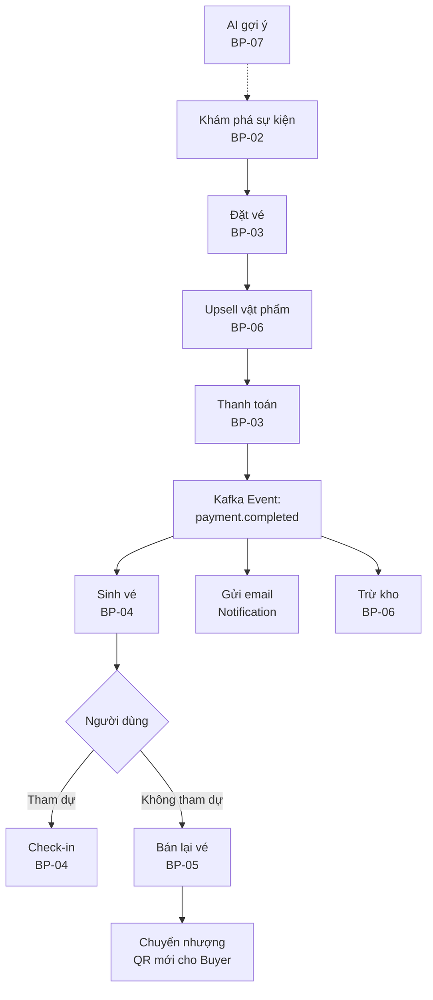

### 6.2. Phương pháp luận áp dụng

Tài liệu này áp dụng các kỹ thuật phân tích nghiệp vụ theo BABOK v3:

| Kỹ thuật BABOK | Section | Áp dụng trong tài liệu |
|---|---|---|
| Process Modelling | 10.35 | Mô hình hóa luồng quy trình bằng flowchart |
| Process Analysis (SIPOC) | 10.34 | Phân tích Supplier-Input-Process-Output-Customer cho mỗi quy trình |
| Roles and Permissions Matrix | 10.39 | Ma trận RACI phân quyền tác nhân |
| Risk Analysis and Management | 10.38 | Nhận diện điểm nghẽn và rủi ro nghiệp vụ |
| Stakeholder List, Map, or Personas | 10.43 | Xác định 4 nhóm tác nhân chính |

### 6.3. Bước tiếp theo

1. **Chi tiết hóa** từng quy trình bằng BPMN 2.0 (Business Process Model and Notation) sử dụng công cụ như draw.io hoặc Camunda Modeler.
2. **Xây dựng Use Case Diagram** và Use Case Specification cho từng chức năng.
3. **Thiết kế Sequence Diagram** cho các luồng nghiệp vụ phức tạp (đặt vé, resale, check-in offline).
4. **Xác định Domain Model** và thiết kế cơ sở dữ liệu chi tiết.
