# Activity Diagrams (Mermaid) – UC-09 đến UC-16

---

## UC-09: Phát hành vé điện tử, QR động và NFT Ticket

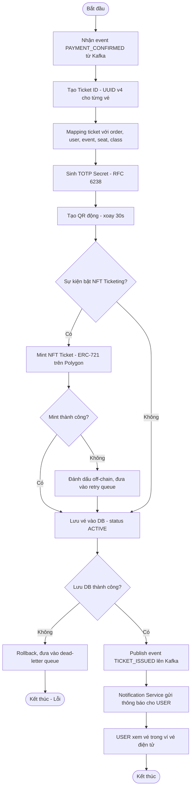

---

## UC-10: Quản lý ví vé điện tử của người dùng

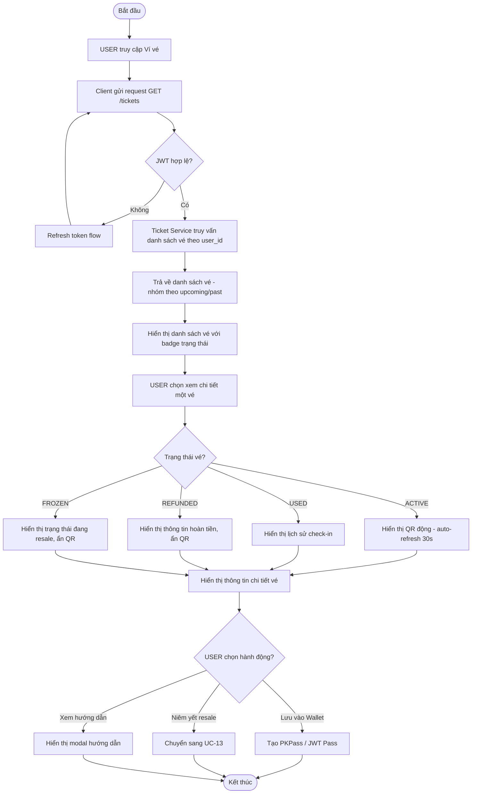

---

## UC-11: Check-in vé tại cổng

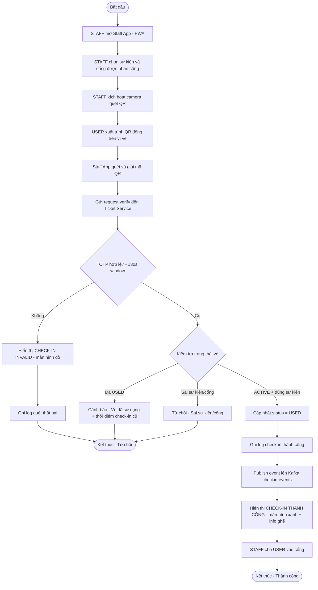

---

## UC-12: Check-in offline và đồng bộ dữ liệu

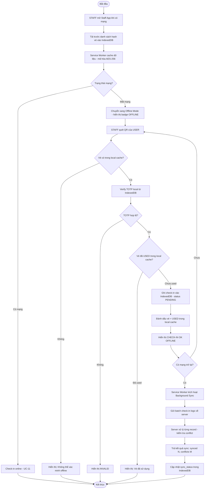

---

## UC-13: Giao dịch vé thứ cấp trên Resale Market

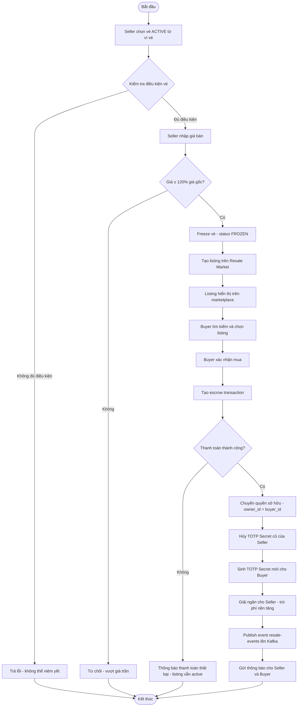

---

## UC-14: Quản lý merchandise, combo và tồn kho

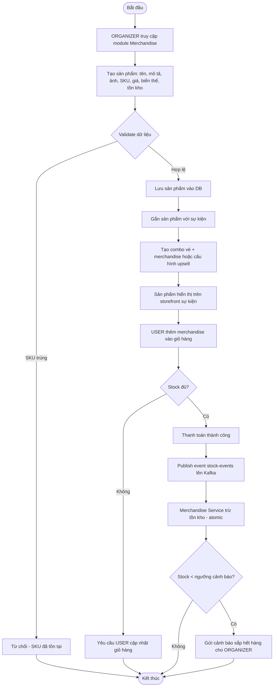

---

## UC-15: Quản trị, báo cáo, đối soát, refund và hóa đơn

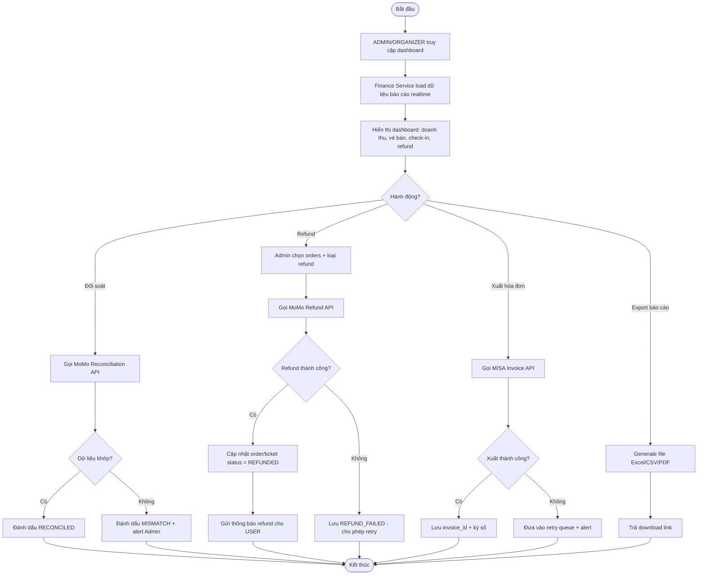

---

## UC-16: Hỏi đáp với AI Chatbot

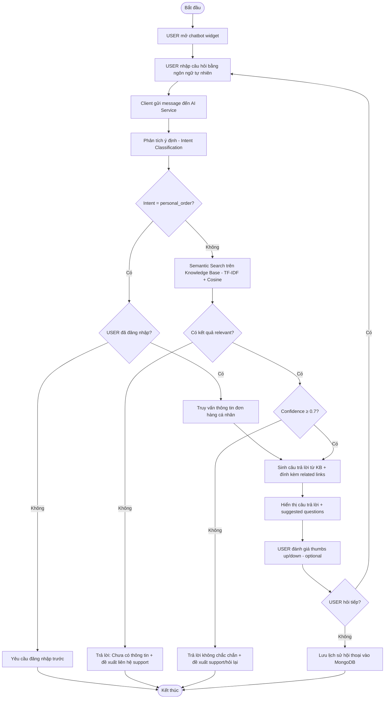

---

# Sequence Diagrams – UC-09 đến UC-16

---

## UC-09 Sequence: Phát hành vé điện tử, QR động và NFT Ticket

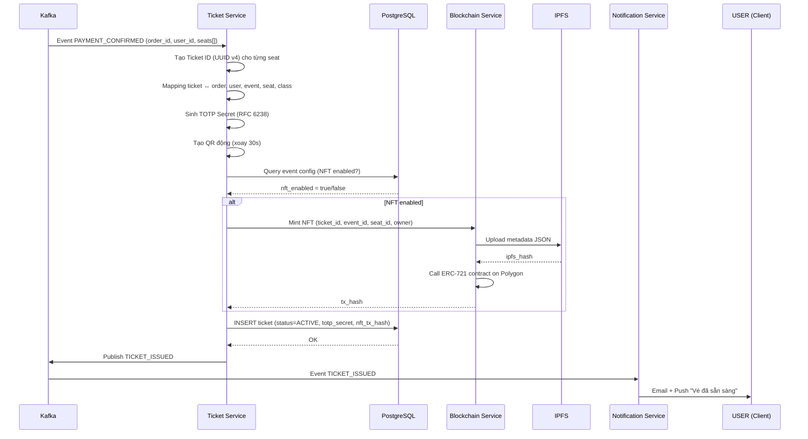

---

## UC-10 Sequence: Quản lý ví vé điện tử

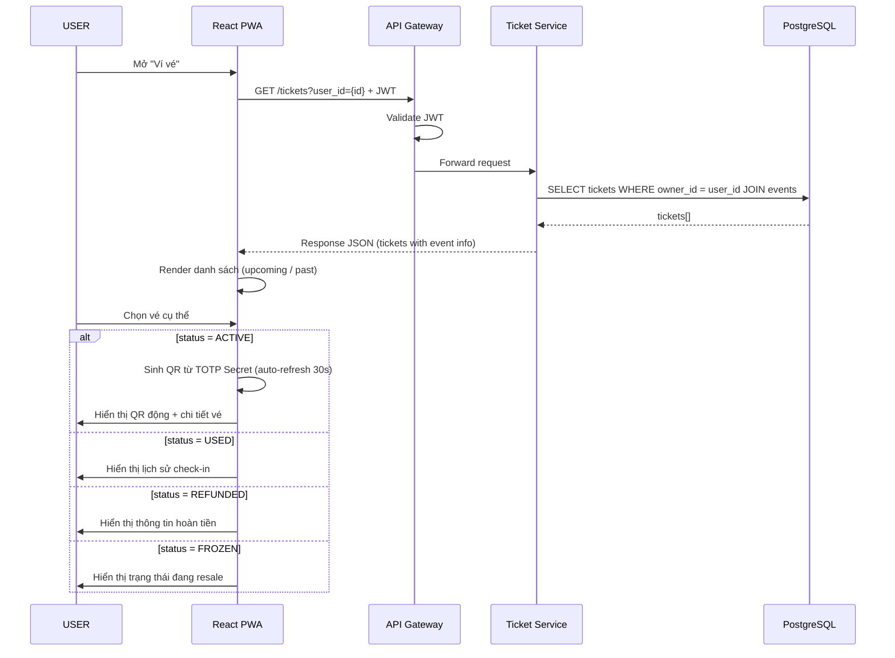

---

## UC-11 Sequence: Check-in vé tại cổng

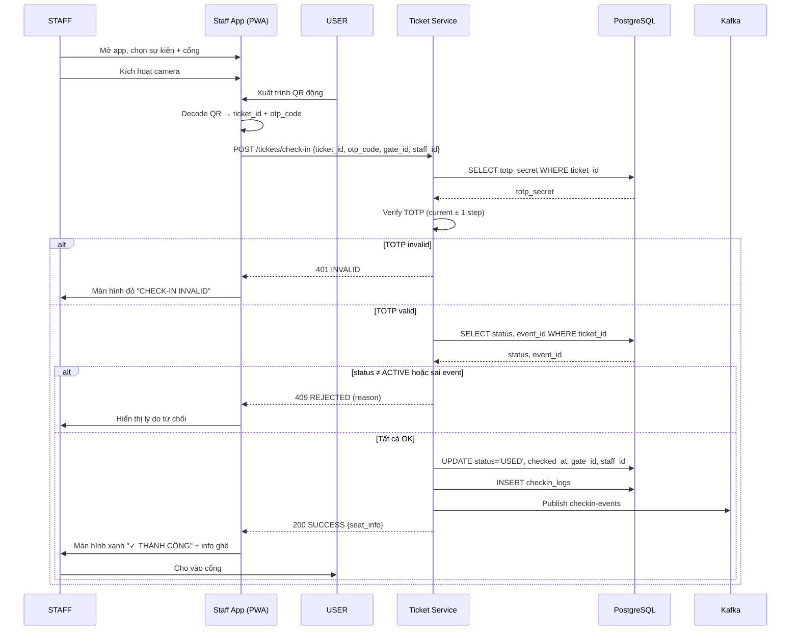

---

## UC-12 Sequence: Check-in offline và đồng bộ

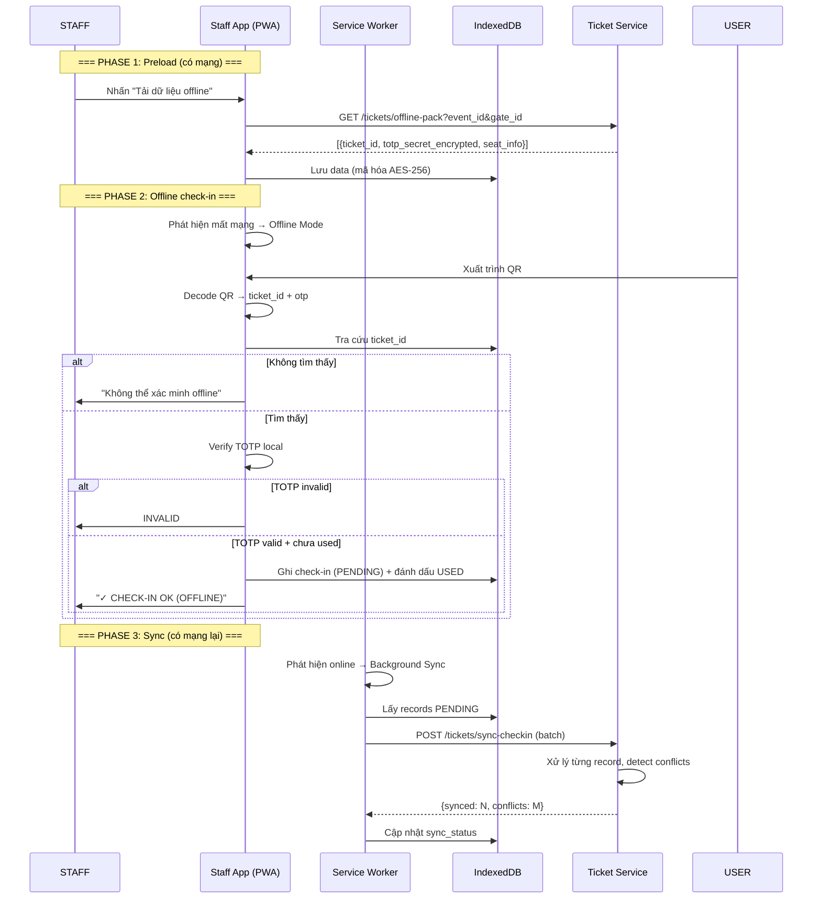

---

## UC-13 Sequence: Giao dịch vé thứ cấp (Resale)

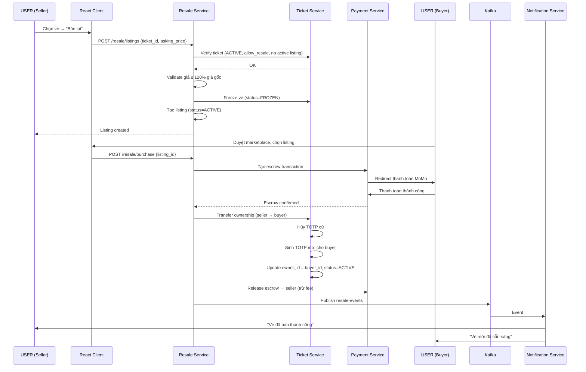

---

## UC-14 Sequence: Quản lý merchandise, combo và tồn kho

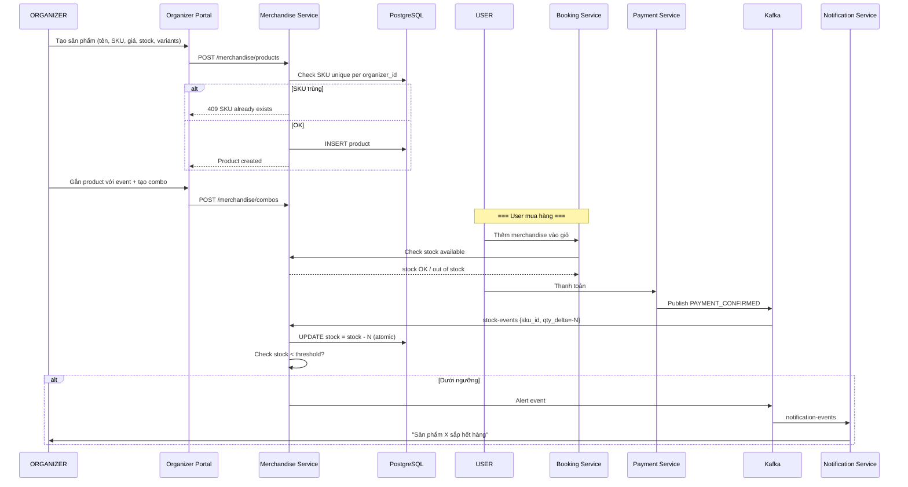

---

## UC-15 Sequence: Quản trị, báo cáo, đối soát, refund và hóa đơn

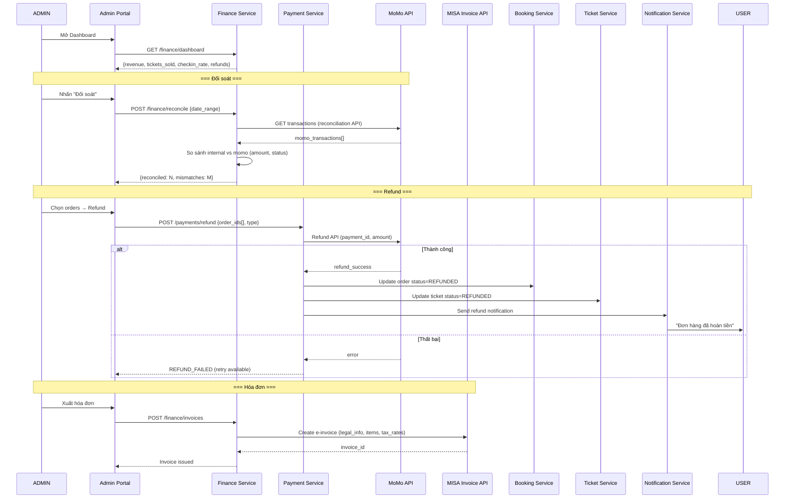

---

## UC-16 Sequence: Hỏi đáp với AI Chatbot

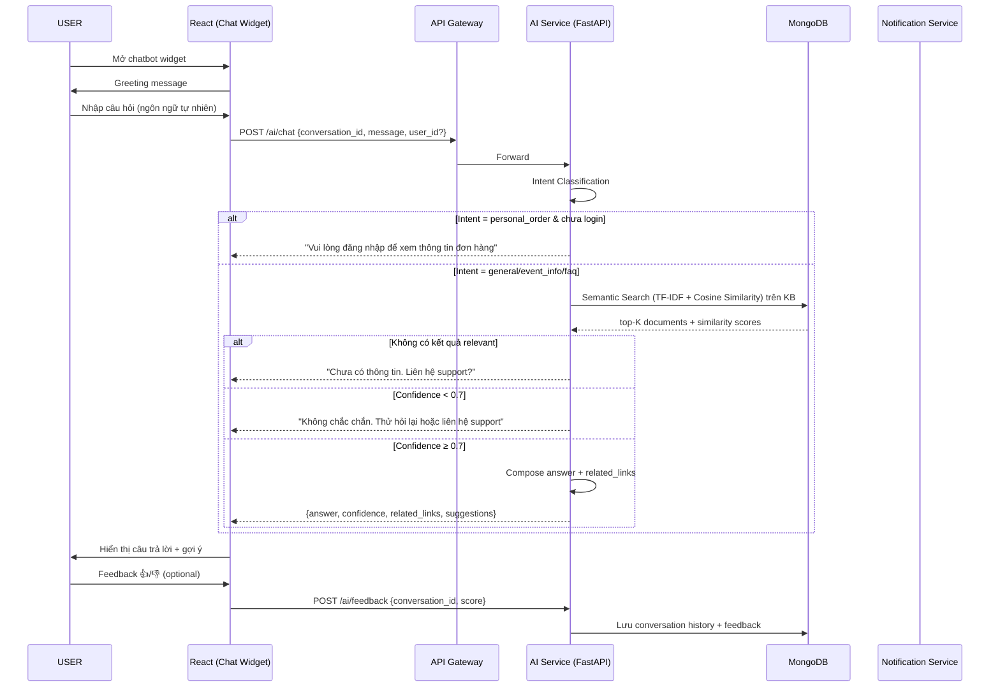
