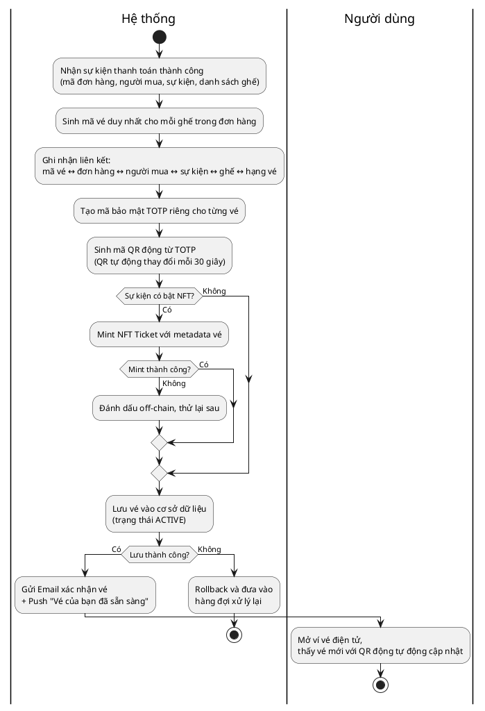
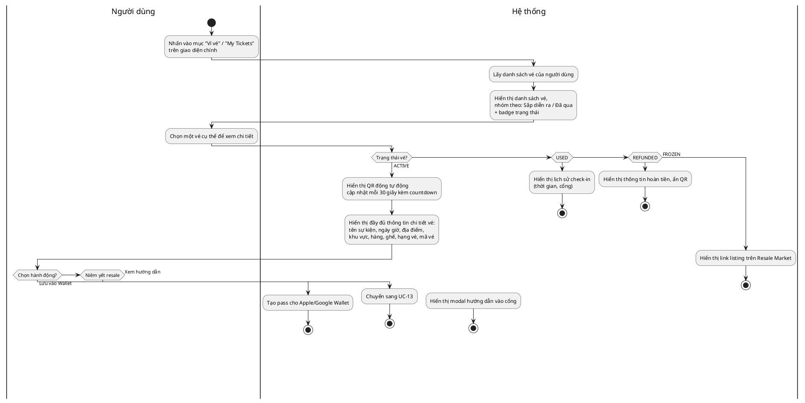
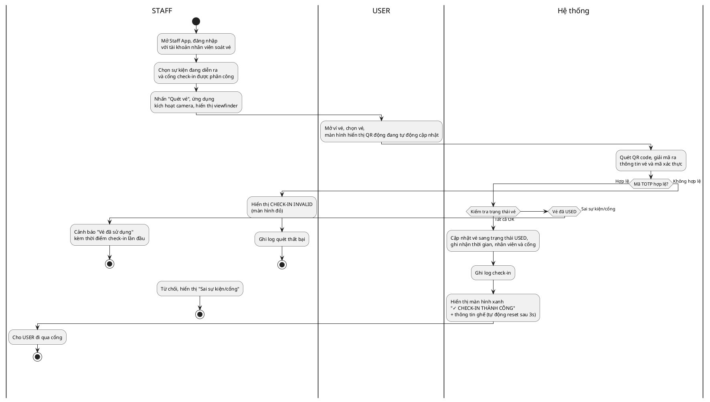
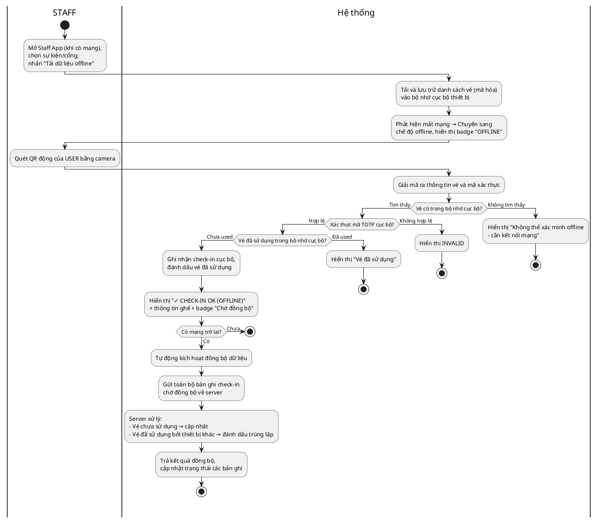
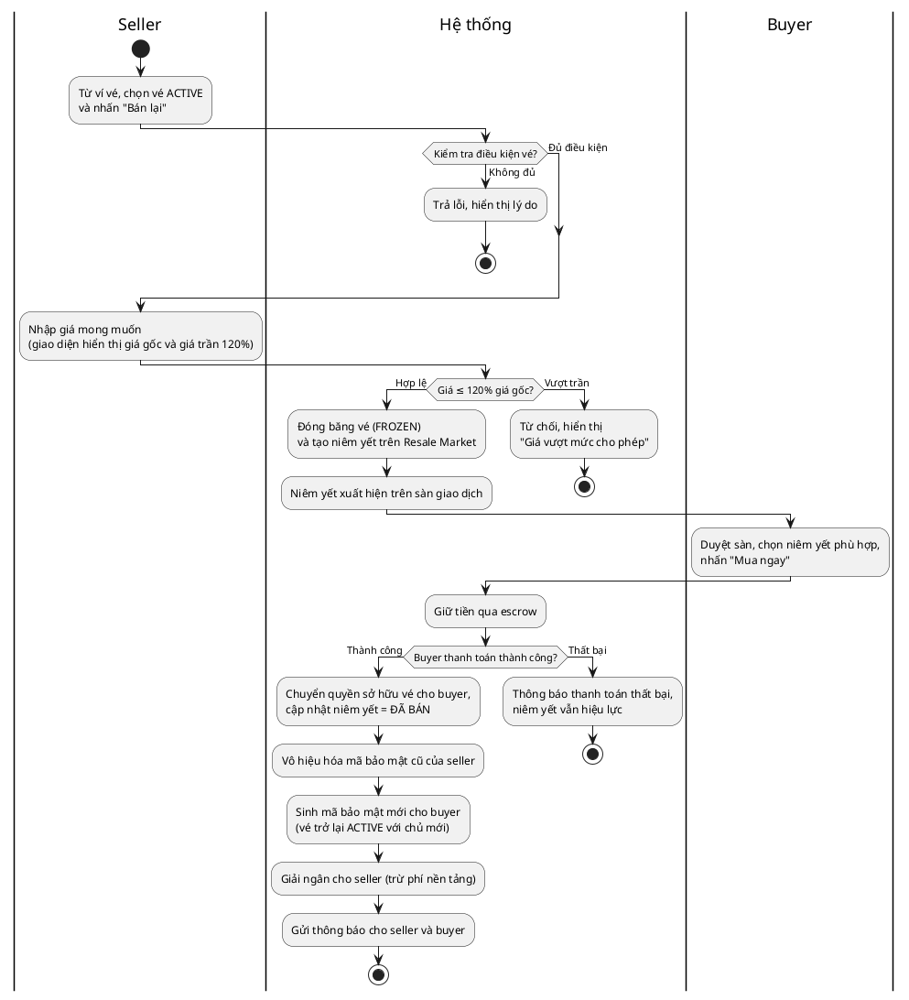
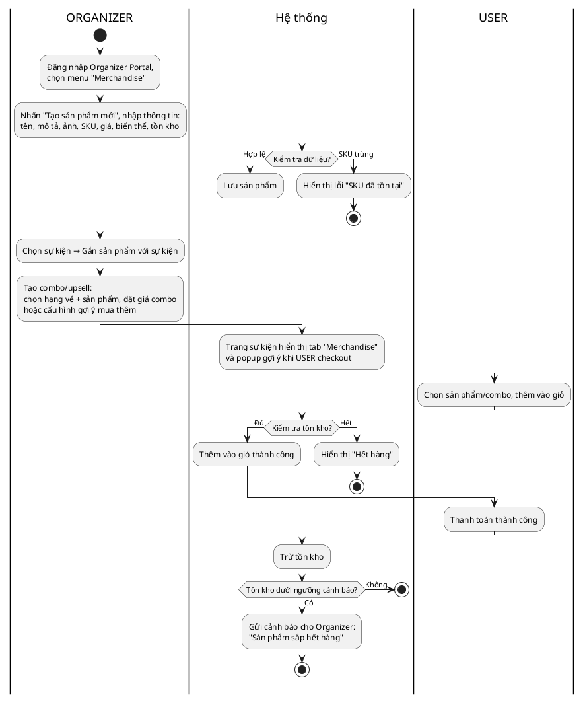
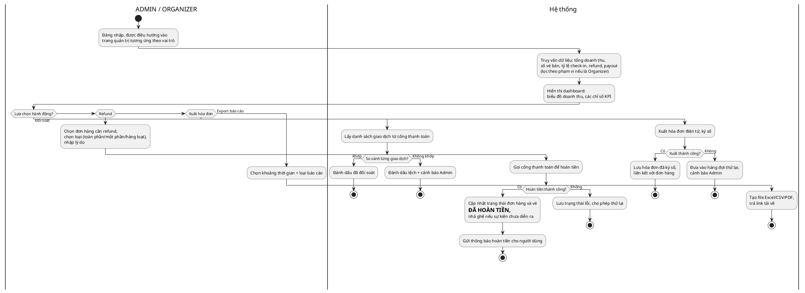
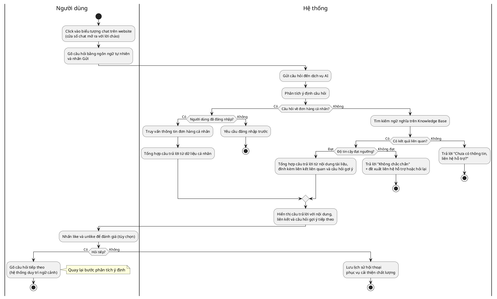

# Activity Diagrams (PlantUML) – UC-09 đến UC-16

---

## UC-09: Phát hành vé điện tử, QR động và NFT Ticket

---

## UC-10: Quản lý ví vé điện tử của người dùng

---

## UC-11: Check-in vé tại cổng

---

## UC-12: Check-in offline và đồng bộ dữ liệu

---

## UC-13: Giao dịch vé thứ cấp trên Resale Market

---

## UC-14: Quản lý merchandise, combo và tồn kho

---

## UC-15: Quản trị, báo cáo, đối soát, refund và hóa đơn

---

## UC-16: Hỏi đáp với AI Chatbot

---
